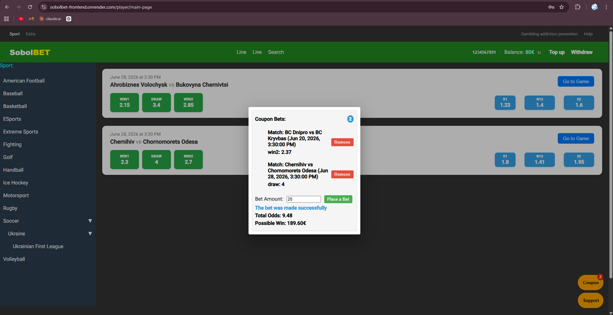
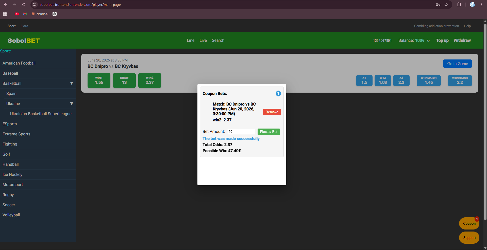
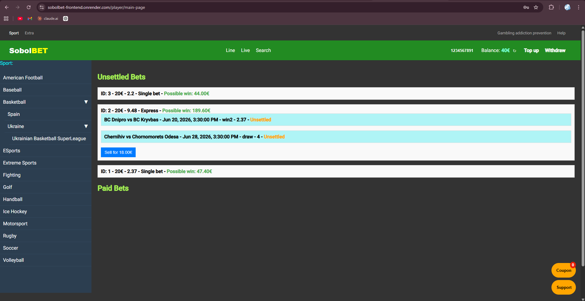
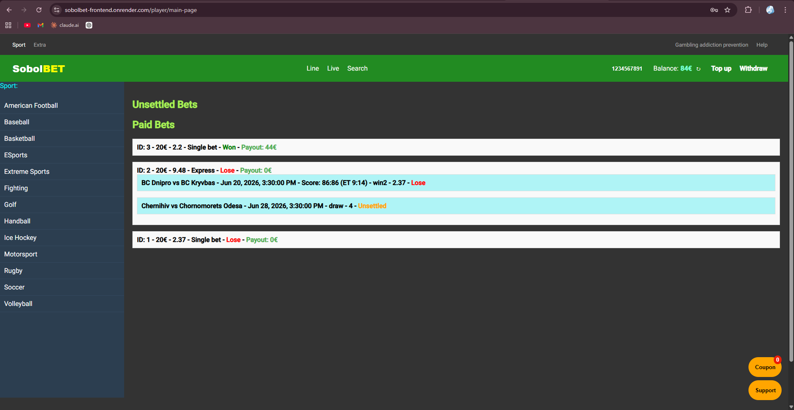
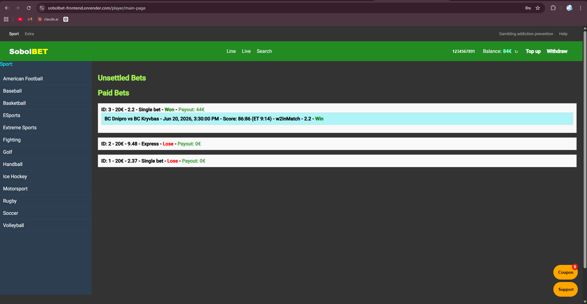
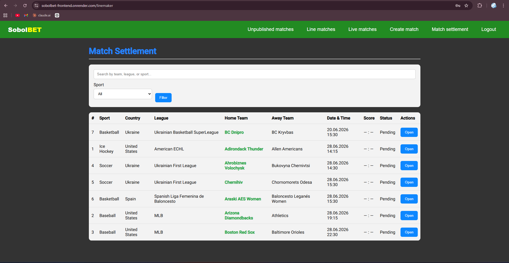
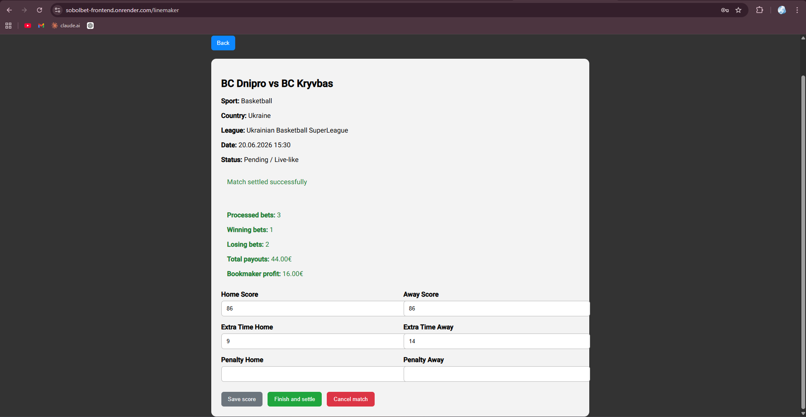
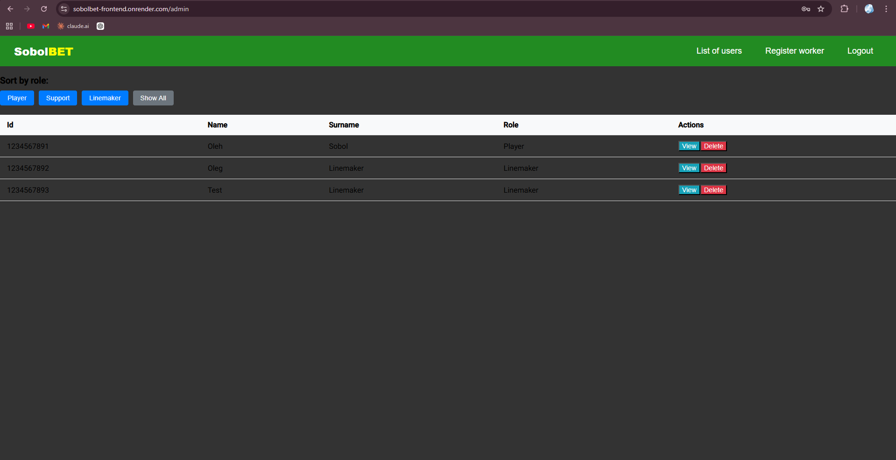

# ⚽ SobolBet — Full-Stack Betting Platform


---

## 🚀 Overview

**SobolBet** is a full-stack web application simulating a sports betting platform.

The project focuses on:

* Backend architecture (Spring Boot)
* REST API design
* Authentication & security (JWT)
* Docker-based deployment
* Cloud infrastructure (Render + Railway)

---

## 🌐 Live Demo

* Frontend: https://sobolbet-frontend.onrender.com
* Backend API: https://sobolbet-backend.onrender.com

⚠️ Backend is hosted on Render (free tier).
First request may take **30–60 seconds** due to cold start.

---

## 🔐 Test Accounts

### Linemaker

```text
login: testlinemaker@test.com  
password: Qwerty1221
```

---

## 🧠 Core Features

### 👤 User

* JWT authentication
* Browse matches
* Place bets (ordinary & express)
* Bet history & payouts
* Balance management

### 🧑‍💼 Linemaker

* Create matches
* Set and update odds
* Publish / unpublish matches
* Settle matches (win / lose / refund)

### 🛠️ Admin

* User management
* Role-based access control

---

## 🏗️ Architecture

```text
Angular (Frontend)
        ↓
Spring Boot REST API (Backend)
        ↓
MySQL (Railway)
```

---

## ⚙️ Tech Stack

### Backend

* Java / Spring Boot
* Spring Security (JWT)
* Hibernate / JPA

### Frontend

* Angular
* TypeScript

### Infrastructure

* Docker & Docker Compose
* Render (Frontend + Backend)
* Railway (MySQL)

---

## 🔐 Security

* JWT authentication
* Role-based authorization (USER / ADMIN / LINEMAKER)
* Refresh tokens
* Environment variables for sensitive data

---

## 📦 DevOps & Deployment

* Dockerized services
* Separate frontend & backend deployments
* Cloud infrastructure:

  * Render (application hosting)
  * Railway (database)
* Environment-based configuration

---

## 📸 Screenshots

### 🎯 Express Bet



---

### 🎲 Ordinary Bet



---

### 📊 Unsettled Bet History



---

### ❌ Lose Bet Settlement



---

### ✅ Won Bet Settlement



---

### ⚙️ Linemaker Settlement Panel




---

### 🛠️ Admin Panel



---

## ⚠️ Known Limitations

* Backend cold start (Render free tier)
* UI optimized for desktop (mobile version not fully supported)

---

## 📈 Planned Improvements

* Responsive UI (mobile support)
* CI/CD improvements
* Redis caching
* WebSockets for live updates
* Scaling & performance improvements

---

## 🧪 Local Setup

```bash
git clone https://github.com/Sultan0Suleyman/betsWebsite.git
cd betsWebsite
docker-compose up --build
```

---

## 🎯 Why This Project

This project demonstrates:

* Backend-focused full-stack development
* Real-world API design
* Cloud deployment experience
* Docker & containerization
* DevOps fundamentals

---

## 📬 Contact

GitHub: https://github.com/Sultan0Suleyman
Email: oleh.sobol@tu-dortmund.de

---

## ⭐ Summary

> Production-like full-stack system with authentication, betting logic, and deployment pipeline — built with strong focus on backend engineering and DevOps practices.


сдела
